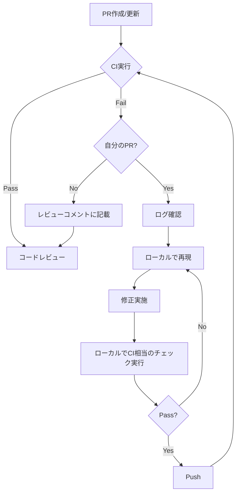

# Code Review Reference Guide

このドキュメントは、体系的なコードレビューのための詳細な基準とチェックリストを提供します。

## 0. CI/CDステータスチェック

### 0.1 GitHub CLI を使用したステータス確認

**基本コマンド**
```bash
# PRのステータス全体を確認
gh pr status

# 特定のPRのチェック状況
gh pr checks [<PR番号>]

# 詳細なステータス情報（JSON形式）
gh pr view <PR番号> --json statusCheckRollup

# 失敗したワークフローのログを確認
gh run list --limit 5
gh run view <run-id> --log-failed
```

### 0.2 CI失敗のカテゴリと対応

#### テスト失敗

**確認方法**
```bash
# テスト結果の確認
gh pr checks | grep -i test
gh run view <run-id> --log-failed | grep -A 10 "FAIL"
```

**自分のPR**:
1. どのテストが失敗したか特定
2. ローカルで再現
   ```bash
   npm test -- --testNamePattern="失敗したテスト名"
   # または
   pytest -k "失敗したテスト名" -v
   ```
3. 原因を修正（コードまたはテスト）
4. すべてのテストを実行して確認
5. コミット・プッシュ

**他人のPRレビュー**:
```markdown
### ⚠️ CI/CD Status - Test Failures

**失敗しているテスト**:
- `test/auth.test.ts:45` - "should handle invalid token"
  - 原因: トークン検証ロジックの変更により期待値が変わった
  - 対応: テストの期待値を更新、またはロジックを見直し

**修正提案**:
[具体的な修正コード]
```

#### ビルドエラー

**確認方法**
```bash
gh run view <run-id> --log-failed | grep -i "error"
```

**よくあるエラー**:
- TypeScript型エラー
- ESLint/Prettier違反
- 依存関係の不整合
- インポートパスの誤り

**自分のPR**:
```bash
# ローカルでビルド実行
npm run build
# または
yarn build

# 型チェック
npm run type-check
# または
tsc --noEmit
```

**他人のPRレビュー**:
```markdown
### ⚠️ CI/CD Status - Build Errors

**TypeScript Errors**:
- `src/api/user.ts:42:15` - Property 'email' does not exist on type 'User'
  - 原因: User型の定義が古い
  - 対応: `types/user.ts`でemailプロパティを追加

**Linter Violations**:
- `src/components/Button.tsx:10` - Missing semicolon
  - 対応: `npm run lint:fix`で自動修正可能
```

#### セキュリティスキャン失敗

**確認方法**
```bash
gh pr checks | grep -i "security\|codeql\|snyk"
```

**自分のPR**:
1. 脆弱性の詳細を確認
2. 推奨される修正を適用
3. 依存関係の更新が必要な場合:
   ```bash
   npm audit fix
   # または手動で更新
   npm install package@latest
   ```

**他人のPRレビュー**:
```markdown
### 🔴 CI/CD Status - Security Issues

**検出された脆弱性**:
- CVE-2024-XXXX: Prototype pollution in lodash < 4.17.21
  - 重要度: High
  - 対応: `package.json`でlodashを4.17.21以上に更新

**推奨アクション**:
npm install lodash@^4.17.21
```

#### Linter/Formatter失敗

**確認方法**
```bash
gh run view <run-id> --log-failed | grep -E "eslint|prettier|rubocop|flake8"
```

**自分のPR**:
```bash
# 自動修正
npm run lint:fix
npm run format

# 確認
npm run lint
npm run format:check
```

**他人のPRレビュー**:
```markdown
### 🟡 CI/CD Status - Code Style Issues

**Linting Errors**:
以下のコマンドで自動修正可能:
npm run lint:fix
npm run format

主な問題:
- インデントの不整合（spaces vs tabs）
- 未使用変数の削除漏れ
- インポート文の順序
```

### 0.3 CI失敗時のワークフロー



### 0.4 ローカルでのCI相当チェック

CI失敗を事前に防ぐため、プッシュ前にローカルで実行:

```bash
# TypeScript
npm run type-check

# Linting
npm run lint

# Formatting
npm run format:check

# Tests
npm test

# Build
npm run build

# すべてをまとめて実行
npm run ci  # package.jsonに定義されている場合
```

**pre-commit hookの設定例**:
```bash
# .husky/pre-commit
#!/bin/sh
. "$(dirname "$0")/_/husky.sh"

npm run lint
npm run type-check
npm test
```

### 0.5 CI失敗の優先度

1. 🔴 **Critical** - すぐに修正が必要:
   - セキュリティスキャン失敗
   - ビルドエラー
   - 本番環境に影響するテスト失敗

2. 🟡 **High** - マージ前に修正:
   - 機能テストの失敗
   - 型エラー

3. 🟠 **Medium** - 修正推奨:
   - Linter違反
   - カバレッジ低下

4. 🟢 **Low** - 任意:
   - Formatterの警告
   - ドキュメント生成の警告

## 1. コード品質

### 1.1 可読性

**変数・関数名**
- ❌ `let d = new Date()` → ⭕ `let currentDate = new Date()`
- ❌ `function proc(x)` → ⭕ `function processUserInput(input)`
- 略語は広く認知されているもののみ使用(例: `id`, `url`, `api`)
- booleanは`is`, `has`, `should`などで始める

**関数の責務**
- 1つの関数は1つの責務のみを持つ
- 関数名が`and`や`or`を含む場合は分割を検討
- 関数の長さは20-30行を目安に

**マジックナンバー**
```typescript
// ❌ Bad
if (user.age > 18) { ... }

// ⭕ Good
const LEGAL_AGE = 18;
if (user.age > LEGAL_AGE) { ... }
```

### 1.2 DRY原則

**重複コードの検出**
- 同じロジックが3回以上出現 → 関数化
- 類似パターンが複数箇所 → 抽象化を検討
- コピペコードは即座に指摘

**適切な抽象化**
```typescript
// ❌ Bad: 重複
function validateEmail(email: string) {
  return /^[^\s@]+@[^\s@]+\.[^\s@]+$/.test(email);
}
function validateBusinessEmail(email: string) {
  return /^[^\s@]+@[^\s@]+\.[^\s@]+$/.test(email) && email.endsWith('.com');
}

// ⭕ Good: 共通化
const EMAIL_REGEX = /^[^\s@]+@[^\s@]+\.[^\s@]+$/;
function isValidEmailFormat(email: string): boolean {
  return EMAIL_REGEX.test(email);
}
function isBusinessEmail(email: string): boolean {
  return isValidEmailFormat(email) && email.endsWith('.com');
}
```

### 1.3 コメント

**良いコメント**
```typescript
// ⭕ 「なぜ」を説明
// Safari doesn't support lookbehind assertions, so we use this workaround
const pattern = /(?:^|[^\\])"/g;

// ⭕ 複雑なアルゴリズムの説明
// Using binary search to optimize lookup (O(log n) vs O(n))
```

**不要なコメント**
```typescript
// ❌ コードと同じことを言っている
// Get user by ID
function getUserById(id: string) { ... }

// ❌ 古い情報
// TODO: Fix this later (3 years ago)
```

## 2. エラーハンドリング

### 2.1 適切な例外処理

**アンチパターン**
```typescript
// ❌ エラーを握りつぶす
try {
  await riskyOperation();
} catch (e) {
  // 何もしない
}

// ❌ @ts-ignoreで無視
// @ts-ignore
const result = unreliableFunction();
```

**推奨パターン**
```typescript
// ⭕ エラーを適切に処理
try {
  await riskyOperation();
} catch (error) {
  logger.error('Failed to execute risky operation', { error });
  throw new OperationError('Operation failed', { cause: error });
}

// ⭕ 型を修正
const result: string | undefined = unreliableFunction();
if (!result) {
  throw new ValidationError('Expected result but got undefined');
}
```

### 2.2 外部API呼び出し

**必須チェック項目**
- [ ] タイムアウト設定
- [ ] リトライメカニズム
- [ ] エラーレスポンスのハンドリング
- [ ] レート制限の考慮

```typescript
// ⭕ Good
async function fetchUserData(userId: string): Promise<User> {
  const maxRetries = 3;
  const timeout = 5000;

  for (let attempt = 0; attempt < maxRetries; attempt++) {
    try {
      const response = await fetch(`/api/users/${userId}`, {
        signal: AbortSignal.timeout(timeout)
      });

      if (!response.ok) {
        if (response.status >= 500) {
          // サーバーエラーはリトライ
          await sleep(Math.pow(2, attempt) * 1000); // exponential backoff
          continue;
        }
        throw new ApiError(`API returned ${response.status}`);
      }

      return await response.json();
    } catch (error) {
      if (attempt === maxRetries - 1) throw error;
    }
  }

  throw new Error('Max retries exceeded');
}
```

### 2.3 入力検証

```typescript
// ⭕ すべての外部入力を検証
function createUser(input: unknown): User {
  // 型ガード
  if (!isValidUserInput(input)) {
    throw new ValidationError('Invalid user input');
  }

  // ビジネスルール検証
  if (input.age < 0 || input.age > 150) {
    throw new ValidationError('Age must be between 0 and 150');
  }

  // サニタイズ
  const sanitizedEmail = input.email.toLowerCase().trim();

  return {
    name: input.name,
    email: sanitizedEmail,
    age: input.age
  };
}
```

## 3. セキュリティ

### 3.1 認証情報の管理

**即座に修正が必要**
```typescript
// ❌ Critical: ハードコード
const API_KEY = "sk-1234567890abcdef";
const PASSWORD = "admin123";

// ⭕ Good: 環境変数
const API_KEY = process.env.API_KEY;
if (!API_KEY) {
  throw new Error('API_KEY must be set in environment');
}
```

### 3.2 OWASP Top 10チェック

**Injection攻撃**
```typescript
// ❌ SQL Injection
const query = `SELECT * FROM users WHERE id = ${userId}`;

// ⭕ Parameterized query
const query = 'SELECT * FROM users WHERE id = ?';
db.execute(query, [userId]);
```

**XSS (Cross-Site Scripting)**
```typescript
// ❌ Dangerous
element.innerHTML = userInput;

// ⭕ Safe
element.textContent = userInput;
// または
element.innerHTML = DOMPurify.sanitize(userInput);
```

**CSRF対策**
- CSRFトークンの実装確認
- SameSite Cookie属性の設定

### 3.3 最小権限の原則

```typescript
// ❌ 過剰な権限
fs.chmodSync('/app/config.json', 0o777);

// ⭕ 必要最小限
fs.chmodSync('/app/config.json', 0o600); // owner read/write only
```

## 4. テスト

### 4.1 テストカバレッジ

**必須テストケース**
- 正常系(Happy Path)
- 境界値
- エラーケース
- エッジケース

```typescript
describe('calculateDiscount', () => {
  it('should return 0 for negative amounts', () => {
    expect(calculateDiscount(-100)).toBe(0);
  });

  it('should return 10% for amounts between 100-1000', () => {
    expect(calculateDiscount(100)).toBe(10);
    expect(calculateDiscount(1000)).toBe(100);
  });

  it('should throw error for non-numeric input', () => {
    expect(() => calculateDiscount('abc' as any)).toThrow();
  });
});
```

### 4.2 テストの品質

**アンチパターン**
```typescript
// ❌ テスト間の依存
let userId: string;
it('should create user', () => {
  userId = createUser();
});
it('should delete user', () => {
  deleteUser(userId); // 前のテストに依存
});

// ❌ 実装の詳細をテスト
expect(component.state.isLoading).toBe(true); // 内部実装
```

**推奨パターン**
```typescript
// ⭕ 独立したテスト
it('should delete user', () => {
  const userId = createUser(); // 各テストで準備
  deleteUser(userId);
  expect(getUser(userId)).toBeNull();
});

// ⭕ 振る舞いをテスト
expect(screen.getByText('Loading...')).toBeInTheDocument(); // ユーザーから見た振る舞い
```

## 5. パフォーマンス

### 5.1 N+1問題

```typescript
// ❌ N+1 クエリ
async function getPostsWithAuthors(postIds: string[]) {
  const posts = await db.posts.findMany({ where: { id: { in: postIds } } });

  for (const post of posts) {
    post.author = await db.users.findUnique({ where: { id: post.authorId } }); // N回クエリ
  }

  return posts;
}

// ⭕ 一度にフェッチ
async function getPostsWithAuthors(postIds: string[]) {
  const posts = await db.posts.findMany({
    where: { id: { in: postIds } },
    include: { author: true } // JOIN
  });

  return posts;
}
```

### 5.2 メモ化とキャッシング

```typescript
// ⭕ 計算結果のキャッシュ
const expensiveCalculation = memoize((input: number) => {
  // 重い計算
  return result;
});

// ⭕ APIレスポンスのキャッシュ
const cache = new Map<string, { data: any, timestamp: number }>();
const CACHE_TTL = 5 * 60 * 1000; // 5分

async function fetchWithCache(url: string) {
  const cached = cache.get(url);
  if (cached && Date.now() - cached.timestamp < CACHE_TTL) {
    return cached.data;
  }

  const data = await fetch(url).then(r => r.json());
  cache.set(url, { data, timestamp: Date.now() });
  return data;
}
```

### 5.3 リソースリーク

```typescript
// ❌ リソースリーク
function processFile(filename: string) {
  const fd = fs.openSync(filename, 'r');
  const data = fs.readFileSync(fd);
  // fd が閉じられていない!
  return data;
}

// ⭕ 適切なクリーンアップ
function processFile(filename: string) {
  const fd = fs.openSync(filename, 'r');
  try {
    return fs.readFileSync(fd);
  } finally {
    fs.closeSync(fd);
  }
}

// ⭕ さらに良い: 高レベルAPI使用
function processFile(filename: string) {
  return fs.readFileSync(filename); // 自動的にクローズ
}
```

## 6. 保守性

### 6.1 技術的負債の記録

```typescript
// ⭕ 明示的な記録
/**
 * TECH DEBT: この実装は一時的な回避策です
 *
 * 理由: サードパーティライブラリのバグ(issue #123)
 * TODO: バージョン2.0がリリースされたら削除
 * 期限: 2024 Q2
 * 担当: @username
 */
function temporaryWorkaround() {
  // ...
}
```

### 6.2 依存関係の管理

**チェック項目**
- [ ] 本当に必要な依存か?
- [ ] ライセンスは適切か?
- [ ] メンテナンスされているか?(最終更新日確認)
- [ ] バンドルサイズへの影響は?
- [ ] セキュリティ脆弱性はないか?

```bash
# サイズ確認
npm install --dry-run <package>

# 脆弱性チェック
npm audit

# 代替パッケージの検討
npx bundlephobia <package>
```

## 7. プロジェクトコンテキスト別の基準

### 7.1 プロトタイプ段階
- エラーハンドリング: 基本的なものでOK
- テスト: 主要な機能のみ
- パフォーマンス: 明らかな問題のみ修正
- ドキュメント: 最小限

### 7.2 MVP段階
- エラーハンドリング: 主要フローは必須
- テスト: 重要機能は必須
- パフォーマンス: ユーザー体験に影響する部分
- ドキュメント: 基本的なREADME必須

### 7.3 本番環境
- エラーハンドリング: すべて必須
- テスト: 高いカバレッジ必須
- パフォーマンス: すべて最適化
- ドキュメント: 包括的

## レビューコメントのテンプレート

### Critical Issue
```
🔴 **Security**: ハードコードされたAPIキーを検出しました

**場所**: src/api/client.ts:15
**問題**:
const API_KEY = "sk-1234...";

**修正方法**:
1. .env.exampleを作成してAPI_KEY=を追加
2. コード内では process.env.API_KEY を使用
3. 現在のキーは無効化して再発行

**参考**: https://12factor.net/config
```

### Warning
```
🟡 **Performance**: N+1クエリの可能性

**場所**: src/services/posts.ts:25-30
**理由**: ループ内でDBクエリを実行しているため、パフォーマンス低下の原因となります

**提案**: include オプションで一度にフェッチすることを検討してください
```

### Suggestion
```
💡 **Code Quality**: 関数の分割を検討

この関数は現在50行ありますが、以下の3つの責務があります:
1. バリデーション
2. データ変換
3. DB保存

それぞれを独立した関数に分割すると、テストしやすく読みやすくなります。
```
