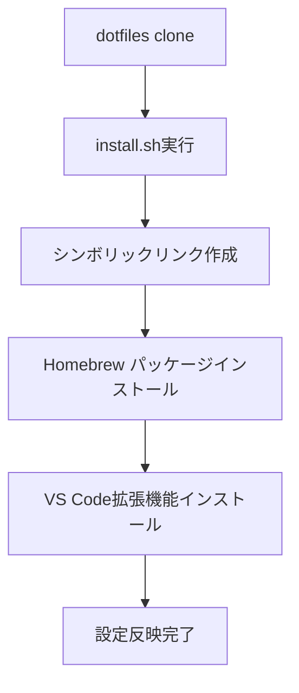
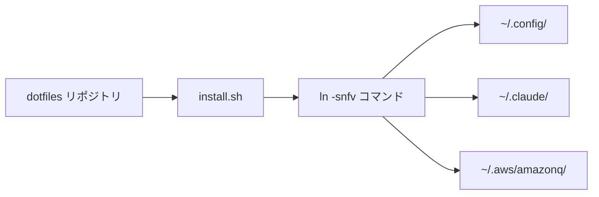

# Dotfiles アーキテクチャ設計（逆生成）

## 分析日時
2025-08-02

## システム概要

### 実装されたアーキテクチャ
- **パターン**: Configuration Management Repository
- **管理方式**: シンボリックリンクベースの設定同期
- **構成**: 開発環境設定の集約管理

### 技術スタック

#### シェル環境
- **シェル**: Zsh
- **プロンプト**: Starship
- **プラグインマネージャー**: Sheldon
- **補完**: zsh-completions, zsh-autosuggestions, zsh-syntax-highlighting

#### パッケージ管理
- **パッケージマネージャー**: Homebrew (macOS)
- **フォント管理**: Homebrew Cask Fonts
- **アプリケーション管理**: Homebrew Cask

#### エディタ・IDE
- **エディタ**: Visual Studio Code
- **AI支援**: Claude Code, GitHub Copilot
- **拡張機能**: 32個の開発支援拡張機能

#### 開発ツール
- **バージョン管理**: Git, GitHub CLI, Hub
- **クラウド**: AWS CLI, Azure CLI, Google Cloud SDK
- **コンテナ**: Docker Desktop
- **言語ランタイム**: asdf (多言語バージョン管理)
- **データベースツール**: mycli, pgcli, DuckDB
- **セキュリティ**: Trivy, 1Password CLI

#### その他ツール
- **通知**: terminal-notifier
- **ファイル検索**: peco, ghq
- **文書作成**: draw.io, Notion
- **デザイン**: Figma

## ディレクトリ構成

### 発見されたディレクトリ構造
```
dotfiles/
├── Brewfile                    # Homebrew依存関係定義
├── README.md                   # プロジェクト概要とセットアップ手順
├── install.sh                  # 自動セットアップスクリプト
├── claude/
│   └── settings.json          # Claude Code設定
├── cline/
│   └── browser-tools-mcp/     # ブラウザツールMCP設定
├── config/
│   ├── sheldon/
│   │   └── plugins.toml       # Zshプラグイン定義
│   └── starship.toml          # プロンプト設定
└── vscode/
    ├── extensions             # VS Code拡張機能リスト
    ├── keybindings.json       # キーバインド設定
    └── settings.json          # エディタ設定
```

### 設定管理責務分析
- **Brewfile**: パッケージとアプリケーションの依存関係管理
- **install.sh**: 設定ファイルのシンボリックリンク作成
- **config/**: シェルとプロンプトの設定
- **vscode/**: エディタ設定とプラグイン管理
- **claude/**: AI開発ツール設定

## 設定管理パターン

### 発見されたパターン
- **Symbolic Link Pattern**: ホームディレクトリへの設定ファイル同期
- **Package Declaration Pattern**: Brewfileでの宣言的パッケージ管理
- **Extension List Pattern**: テキストファイルでの拡張機能管理
- **Configuration as Code**: 設定ファイルのバージョン管理

## セットアップフロー

### インストールプロセス


### 設定同期プロセス


## 非機能要件の実装状況

### 保守性
- **バージョン管理**: Git によるトラッキング
- **自動化**: install.sh による一括セットアップ
- **宣言的管理**: Brewfile, extensions ファイル

### ポータビリティ
- **OS対応**: macOS専用設定
- **環境分離**: ユーザー固有設定の分離
- **復元性**: 新環境での簡単復元

### セキュリティ
- **認証情報管理**: MCP設定での入力フィールド活用
- **権限管理**: 適切なファイル権限設定
- **安全なリンク**: 強制上書きでの安全なシンボリックリンク

## 設定管理の特徴

### Homebrew管理
- **CLI ツール**: 28個の開発ツール
- **フォント**: HackGen系フォント
- **アプリケーション**: 20個のGUIアプリケーション

### VS Code拡張機能
- **AI支援**: Claude Code, GitHub Copilot
- **言語サポート**: Go, TypeScript, Terraform, GraphQL
- **開発体験**: GitLens, Material Icon Theme, Draw.io

### シェル環境
- **プロンプト**: カスタムStarship設定（AWS/GCP表示）
- **補完**: 高度な補完システム
- **プラグイン**: 遅延読み込み対応

## 推奨改善点

### 現状の課題
1. OS固有設定のため他OSでの利用不可
2. 設定変更の自動反映機能なし
3. バックアップ機能なし

### 改善提案
1. **クロスプラットフォーム対応**: OS検出とOS別設定分離
2. **自動同期**: 設定変更の自動検出と反映
3. **バックアップ機能**: 既存設定のバックアップ作成
4. **テスト機能**: 設定の妥当性検証
