# 設定管理データフロー（逆生成）

## セットアップフロー

### 初回環境構築フロー
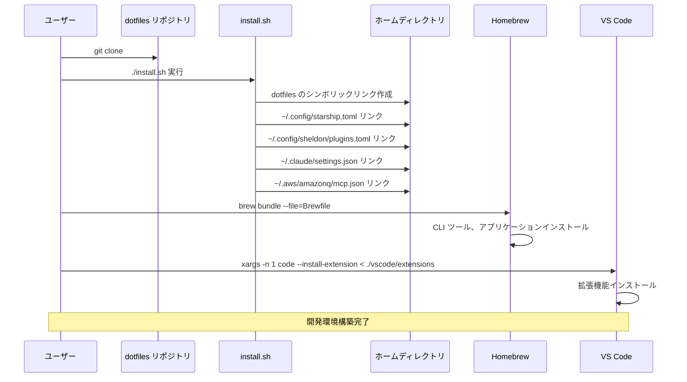

### 設定同期フロー
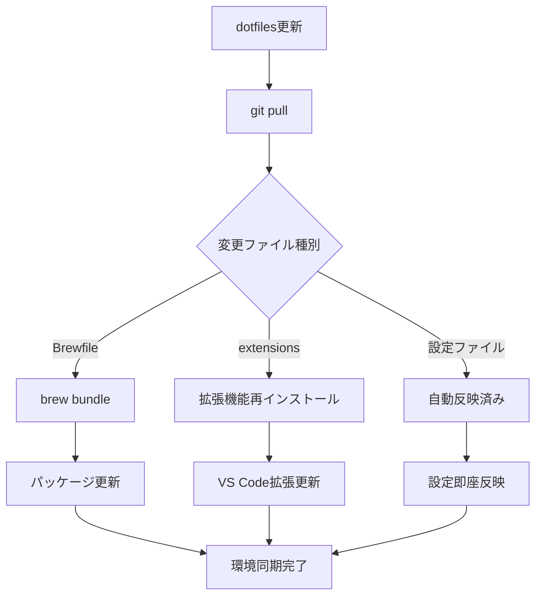

## ツール連携フロー

### シェル環境の初期化フロー
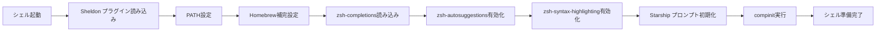

### VS Code 環境構築フロー
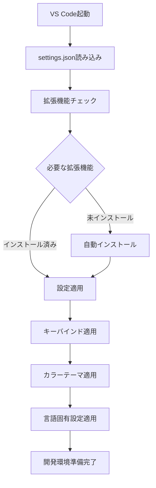

### Claude Code 連携フロー
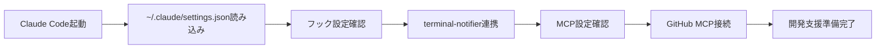

## 設定ファイル依存関係

### 設定ファイル間の関係
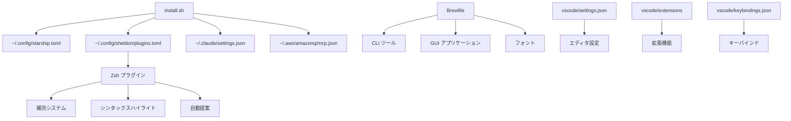

### 外部依存関係
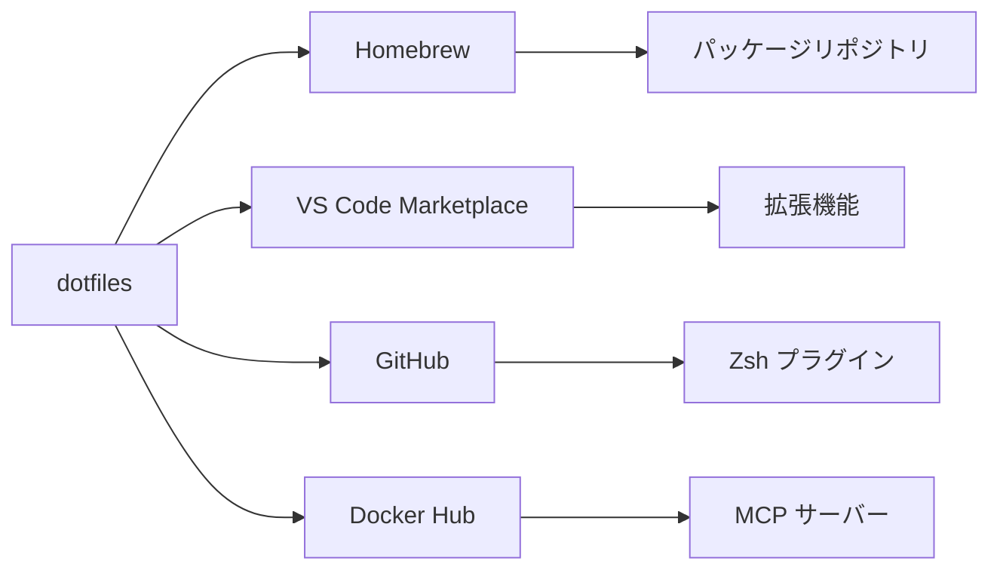

## 設定更新プロセス

### 設定変更の伝播
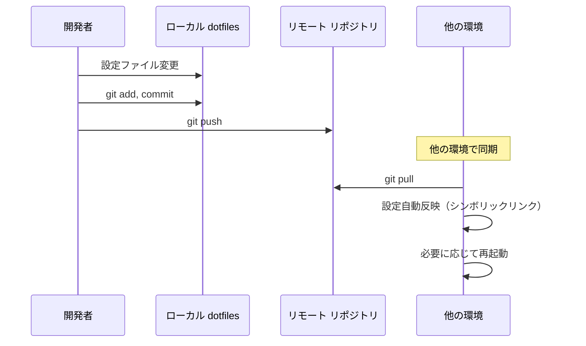

### パッケージ更新フロー
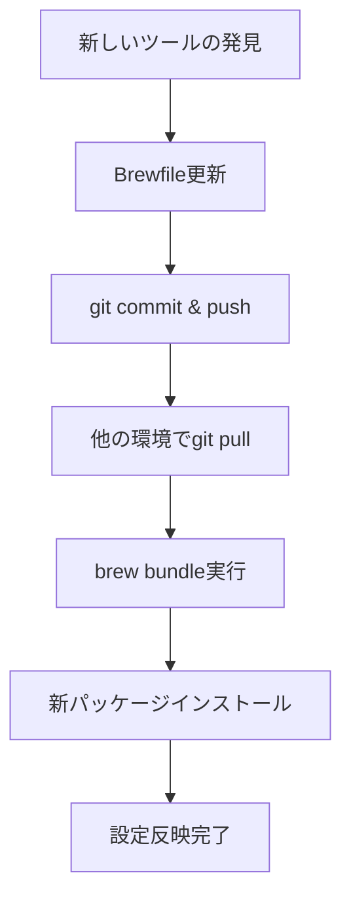

## エラーハンドリングフロー

### インストールエラーの処理
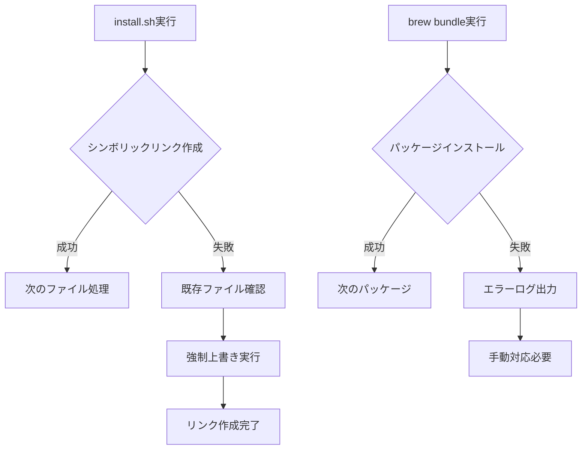

### 設定競合の解決
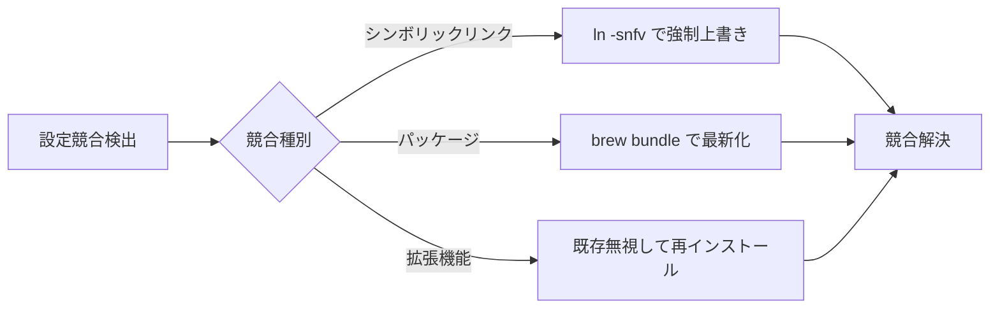

## 通知フロー

### Claude Code 通知システム
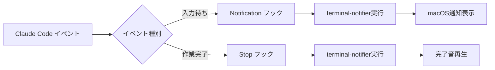

この設定管理システムは、開発環境の一貫性と再現性を重視した設計となっており、シンボリックリンクによる自動同期とパッケージ管理の組み合わせで効率的な環境構築を実現しています。