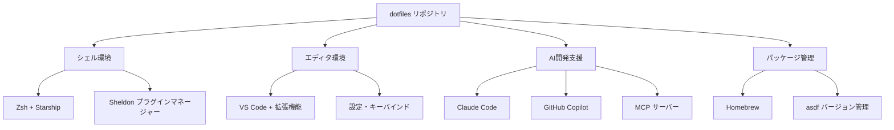

# ツール統合設計（逆生成）

## ツール統合マップ

### 開発ツールの連携構成


## AI開発支援ツール統合

### Claude Code 統合設計
```json
{
  "hooks": {
    "Notification": [
      {
        "matcher": "",
        "hooks": [
          {
            "type": "command",
            "command": "terminal-notifier -title \"Claude Code\" -message \"入力待ちプロンプトが表示されました\" -sound default"
          }
        ]
      }
    ],
    "Stop": [
      {
        "matcher": "",
        "hooks": [
          {
            "type": "command", 
            "command": "terminal-notifier -title \"Claude Code\" -message \"作業が完了しました\" -sound Glass"
          }
        ]
      }
    ]
  }
}
```

**統合ポイント**:
- macOS通知システムとの連携
- 作業状態の視覚的フィードバック
- 異なる作業段階での音声通知

### GitHub Copilot 統合
VS Code設定での統合:
```json
{
  "github.copilot.nextEditSuggestions.enabled": true,
  "gitlens.ai.model": "vscode",
  "gitlens.ai.vscode.model": "copilot:claude-3.5-sonnet"
}
```

### MCP (Model Context Protocol) 統合
```json
{
  "mcp": {
    "inputs": [
      {
        "type": "promptString",
        "id": "github_token",
        "description": "GitHub Personal Access Token",
        "password": true
      }
    ],
    "servers": {
      "github": {
        "command": "docker",
        "args": ["run", "-i", "--rm", "-e", "GITHUB_PERSONAL_ACCESS_TOKEN", "ghcr.io/github/github-mcp-server"],
        "env": {
          "GITHUB_PERSONAL_ACCESS_TOKEN": "${input:github_token}"
        }
      }
    }
  }
}
```

## 言語・フレームワーク統合

### Go言語開発環境
```json
{
  "go.formatTool": "goimports",
  "go.lintTool": "golangci-lint",
  "go.lintFlags": ["--fast"],
  "[go]": {
    "editor.defaultFormatter": "golang.go"
  }
}
```

**関連ツール**:
- `golang-migrate`: データベースマイグレーション
- VS Code Go拡張: 統合開発環境

### TypeScript/JavaScript 開発環境
```json
{
  "[javascriptreact]": {
    "editor.defaultFormatter": "biomejs.biome",
    "editor.codeActionsOnSave": {
      "source.fixAll.biome": "explicit",
      "source.organizeImports.biome": "explicit",
      "source.addMissingImports": "always"
    }
  },
  "[typescriptreact]": {
    "editor.defaultFormatter": "biomejs.biome"
  },
  "[typescript]": {
    "editor.defaultFormatter": "biomejs.biome"
  }
}
```

**統合ツール**:
- Biome: フォーマッター・リンター
- ES7 React スニペット
- TypeScript インポーター

### Terraform インフラ開発
```json
{
  "[terraform]": {
    "editor.defaultFormatter": "hashicorp.terraform",
    "editor.formatOnSave": true,
    "editor.formatOnSaveMode": "file"
  },
  "editor.codeActionsOnSave": {
    "source.formatAll.terraform": "explicit"
  }
}
```

**関連ツール**:
- `tflint`: Terraform リンター
- HashiCorp Terraform 拡張
- `packer`: イメージ作成

## クラウド・インフラ統合

### AWS 統合
**CLI ツール**:
- `awscli`: AWS コマンドライン
- `aws-vault`: 認証情報管理

**Starship 表示設定**:
```toml
[aws]
format = 'on [$symbol($profile )(\($region\) )]($style)'
style = "bold blue"

[aws.region_aliases]
ap-northeast-1 = "jp"
```

### Google Cloud 統合
**インストール**:
- `google-cloud-sdk`: GCP CLI

**Starship 表示**:
```toml
[gcloud]
symbol = '️🇬️ '
format = '[$symbol$active]($style) '
style = 'bold yellow'
```

### Azure 統合
- `azure-cli`: Azure コマンドライン統合

## データベース統合

### データベース管理ツール
```bash
# PostgreSQL
brew "libpq"      # PostgreSQL クライアントライブラリ
brew "pgcli"      # PostgreSQL CLI

# MySQL
brew "mycli"      # MySQL CLI

# 分析用
brew "duckdb"     # 分析用データベース
```

### 接続管理
- VS Code PostgreSQL拡張での接続管理
- pgcli/mycli による対話的操作

## コンテナ・仮想化統合

### Docker 統合
**アプリケーション**:
- Docker Desktop

**Starship 表示**:
```toml
[docker_context]
format = "via [🐋 $context](blue bold)"
```

**VS Code 統合**:
- Docker拡張機能
- Dev Containers拡張機能

### VS Code Dev Containers
```json
{
  "ms-azuretools.vscode-containers": "enabled"
}
```

## セキュリティツール統合

### セキュリティスキャン
```bash
brew "trivy"      # コンテナ・IaCセキュリティスキャン
brew "actionlint" # GitHub Actions linter
```

### 認証管理
```bash
brew "gnupg"           # GPG暗号化
brew "pinentry-mac"    # macOS GPG PIN入力
```

## 文書・可視化統合

### 図・文書作成
**アプリケーション**:
- draw.io: フローチャート・図作成
- Notion: 文書管理

**VS Code統合**:
- draw.io拡張機能
- Mermaid図プレビュー
- Markdown PDF出力

### Mermaid 統合
```json
{
  "bierner.markdown-mermaid": "enabled"
}
```

## 通知・UI統合

### macOS通知統合
```bash
brew "terminal-notifier"  # コマンドライン通知
```

**Claude Code との連携**:
- 作業開始・完了通知
- エラー・警告通知

### UI・UX ツール
**アプリケーション**:
- BetterTouchTool: ジェスチャカスタマイズ
- Alfred: アプリケーションランチャー
- Stats: システム監視

## 設定同期・バックアップ

### 設定ファイル同期
```bash
# シンボリックリンクによる自動同期
ln -snfv "$DIR"/config/starship.toml "$HOME"/.config/starship.toml
ln -snfv "$DIR"/config/sheldon/plugins.toml "$HOME"/.config/sheldon/plugins.toml
ln -snfv "$DIR"/claude/settings.json "$HOME"/.claude/settings.json
```

### VS Code設定同期
```bash
# 拡張機能リスト出力
code --list-extensions > ./vscode/extensions

# 拡張機能一括インストール
xargs -n 1 code --install-extension < ./vscode/extensions

# Cursor への同期
xargs -n 1 cursor --install-extension < ./vscode/extensions
```

## バージョン管理統合

### 言語バージョン管理
```bash
brew "asdf"  # 多言語バージョンマネージャー
```

**対応言語**:
- Node.js, Python, Ruby, Go等の統合管理

### Git統合
```bash
brew "gh"     # GitHub CLI
brew "hub"    # GitHub操作
brew "ghq"    # リポジトリ管理
```

**VS Code統合**:
- GitLens拡張機能
- GitHub Actions拡張機能

このツール統合設計により、効率的で一貫性のある開発環境が構築され、各ツール間のシームレスな連携が実現されています。